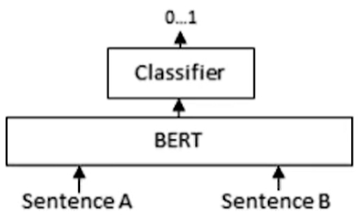

近期，有研究员发布了论文：Memento: Fine-tuning LLM Agents without Fine-tuning LLMs，详见：https://arxiv.org/pdf/2508.16153   https://github.com/Agent-on-the-Fly/Memento ，核心思路其实和RAG是一样的：**user提问后，从case bank找到最接近的case，然后用LLM生成答案返回给user**！不同的地方在于recall后的处理方式：

* 传统的RAG在retrieve后还会继续rerank，把和query接近的答案排在前面。rerank的

  
* Memento的处理方式就不一样了：

  * **State s** ：当前用户状态（用户画像 + 最近session/action 序列 + 上下文）
  * **Memory M (case bank)** ：历史交互的case 集合，每个 case c = (s_i, item_i, outcome_i)（或更丰富的 prompt 模板 + 举例）。这相当于 Memento 的 “cases”
  * **Action a** ：在 Memento 里，动作是“从 Memory 中检索一个 case c”；这里我们把动作集合视为 `cases`（或者在实际推荐中可以是“先检索 case，再让 frozen LLM 生成 item/推荐”）
  * **Policy µ(c | s, M)** ：检索策略—对于当前 s，从 M 中选择哪个 case c 作为 prompt/示例（这里可以理解为in-context learning）。我们用 **Soft Q-Learning 来学习这个 µ**
  * **Reward r** ：用户对推荐的反馈（比如点击=1，未点=0，或更连续的收益如停留时长/付费）
  * **Objective** ：最大化累积 reward + 熵项（MaxEnt objective），即既要高收益也要保留一定探索性。Soft Q-Learning / MaxEnt RL 提供了公式与训练办法

其中差异最大的就是**Policy µ(c | s, M)**了：传统的RAG是直接通过embedding的cosin距离从知识库找出最近的sentence，而这里是使用Policy µ从case bank中选择最合适的case，这又是怎么做到的了？原论文的方案：

* **State / Case 表示（embedding）** ：用一个 state encoder + case encoder（或直接使用预计算的向量）来表示 `s` 和 `c`。
* **检索（Read）** ：用向量检索（ANN/FAISS / torch.topk）**先选 Top-K 候选（降低计算量），然后在这 K 个上用 Q 网络计算分数并按 softmax（温度 α）形成 μ**。论文建议 TopK 作为稳定手段
* **行动（采样/选择 case）** ：从 μ 中采样（或取 argmax / Top1）。
* **环境交互 & 收益** ：把 (s, c) 给 frozen LLM 生成 recommendation/action，观察 reward r 和 next state s′。
* **写入 Memory（Write）** ：把新 case 写入 memory（非参数版本只是 append；参数版本同时用写入样本去更新 Q θ，论文给有 BCE 风格写入损失用于 parametric memory）。
* **在线更新（核心）** ：把 transition 存 replay buffer，按 Eq.(8) 或 Eq.(24) 构造 TD 目标 y=r+γαlog⁡∑c′exp⁡(Q(s′,M′,c′)/α)y=r+\gamma \alpha \log\sum_{c'}\exp(Q(s',M',c')/\alpha)**y**=**r**+**γ**α**lo**g**∑**c**′****exp**(**Q**(**s**′**,**M**′**,**c**′**)**/**α**)，最小化 MSE(Q(s,c), y)，并使用 target network / Polyak 平滑。

测试数据集：https://tianchi.aliyun.com/dataset/140281
