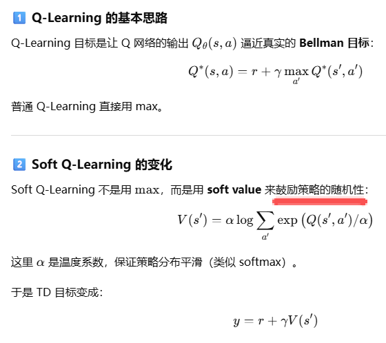

一、近期，有研究员发布了论文：Memento: Fine-tuning LLM Agents without Fine-tuning LLMs，详见：https://arxiv.org/pdf/2508.16153   https://github.com/Agent-on-the-Fly/Memento ，核心思路其实和RAG是一样的：**user提问后，从case bank找到最接近的case，然后用LLM生成答案返回给user**！不同的地方在于recall后的处理方式：

* 传统的RAG在retrieve后还会继续rerank，把和query接近的答案排在前面。rerank的

  
* Memento的处理方式就不一样了：

  * **State s** ：当前用户状态（用户画像 + 最近session/action 序列 + 上下文）
  * **Memory M (case bank)** ：历史交互的case 集合，每个 case c = (s_i, item_i, outcome_i)（或更丰富的 prompt 模板 + 举例）。这相当于 Memento 的 “cases”
  * **Action a** ：在 Memento 里，动作是“从 Memory 中检索一个 case c”；这里我们把动作集合视为 `cases`（或者在实际推荐中可以是“先检索 case，再让 frozen LLM 生成 item/推荐”）
  * **Policy µ(c | s, M)** ：检索策略—对于当前 s，从 M 中选择哪个 case c（检索哪个 case c 要用神经网络“学习”的） 作为 prompt/示例（这里可以理解为in-context learning）。我们用 **Soft Q-Learning 来学习这个 µ**, 这就是所谓的case-retrieval policy（即决定检索哪个 past case 作为参考）；**重点不更新 LLM 的参数，而是更新 case retrieval policy 的参数／估计的 Q 值网络**。
  * **Reward r** ：用户对推荐的反馈（比如点击=1，未点=0，或更连续的收益如停留时长/付费）
  * **Objective** ：最大化累积 reward + 熵项（MaxEnt objective），即既要高收益也要保留一定探索性。Soft Q-Learning / MaxEnt RL 提供了公式与训练办法

其中差异最大的就是**Policy µ(c | s, M)**了：传统的RAG是直接通过embedding的cosin距离从知识库找出最近的sentence，而这里是使用Policy µ从case bank中选择最合适的case，这又是怎么做到的了？原论文的方案：

* **State / Case 表示（embedding）** ：用一个 state encoder + case encoder（或直接使用预计算的向量）来表示 `s` 和 `c`。
* **检索（Read）** ：用向量检索（ANN/FAISS / torch.topk）**先选 Top-K 候选（降低计算量），然后在这 K 个上用 Q 网络计算分数并按 softmax（温度 α）形成 μ**。论文建议 TopK 作为稳定手段
* **行动（采样/选择 case）** ：从 μ 中采样（或取 argmax / Top1）。
* **环境交互 & 收益** ：把 (s, c) 给 frozen LLM 生成 recommendation/action，观察 reward r 和 next state s′。
* **写入 Memory（Write）** ：把新 case 写入 memory（非参数版本只是 append；参数版本同时用写入样本去更新 Q θ，论文给有 BCE 风格写入损失用于 parametric memory）。
* **在线更新（核心）** ：把 transition 存 replay buffer，按 Eq.(8) 或 Eq.(24) 构造 TD 目标 y=r+γαlog⁡∑c′exp⁡(Q(s′,M′,c′)/α)y=r+\gamma \alpha \log\sum_{c'}\exp(Q(s',M',c')/\alpha)**y**=**r**+**γ**α**lo**g**∑**c**′****exp**(**Q**(**s**′**,**M**′**,**c**′**)**/**α**)，最小化 MSE(Q(s,c), y)，并使用 target network / Polyak 平滑。

测试数据集：https://tianchi.aliyun.com/dataset/140281

二、这里用的是soft Q-learning，和传统的Q-learning相比多了soft，这个soft该怎么理解？

1、**目标函数的差异** ：

* **传统 Q-Learning** ：目标是最大化预期累积奖励（expected cumulative reward），即找到一个策略 π 来 max ∑ E[r_t]，其中 r_t 是每个时间步的奖励。Q 值（Q(s,a)）表示在状态 s 下选择行动 a 的预期长期回报，更新公式为 Q(s,a) ← Q(s,a) + α [r + γ max_a' Q(s',a') - Q(s,a)]（TD 更新）。**policy通常是贪婪的（总是选 max Q 的行动）或 ε-greedy（以 ε 概率随机探索）**。
* **Soft Q-Learning** ：目标是最大化预期奖励  **加上策略的熵** ，即 max ∑ E[r_t + α H(π(.|s))]，其中 H(π) = -∑ π(a|s) log π(a|s) 是策略的熵，**α 是温度参数（控制随机性）。这鼓励策略更“软”（soft），不总是选最佳行动，而是保持多样性**。Q 更新类似，但目标值变为 r + γ [α log ∑ exp(Q(s',a')/α)]（soft value，引入 logsumexp 来计算软化的最大值）。

   **本质** ：**传统 Q-Learning 是“确定性”的（deterministic），追求最优路径；Soft Q-Learning 是“随机性”的（stochastic），追求鲁棒性和探索，防止代理过早收敛到次优解**，尤其在不确定或高维环境中（如连续行动空间）。

2、**Policy Derivation 的差异** ：  

* **传统** ：策略 π(a|s) = argmax_a Q(s,a)（贪婪），或 ε-greedy（随机均匀探索）。
* **Soft** ：策略 π(a|s) = exp(Q(s,a)/α) / ∑ exp(Q(s,a')/α)（softmax），概率正比于 Q 值指数，α 大时更随机（均匀分布），α 小时接近贪婪。

    

3、优势与适用场景：

* 传统：简单高效，但容易卡在局部最优（缺乏多样探索），适合离散、低不确定环境。
* Soft：更鲁棒，泛化好，适合噪声大、连续行动或长期规划场景（如机器人或游戏），但计算稍复杂（需 softmax/logsumexp）。

三、这个也能用于agent开发：每个user的偏好都不同，根据用户偏好的历史数据提供个性化的回答！
